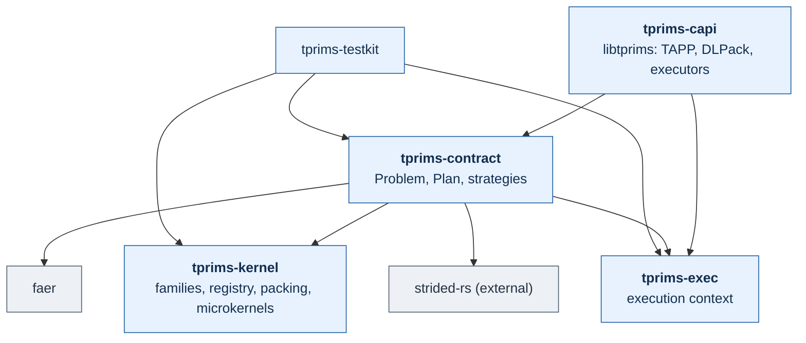

# tprims-rs

tprims is a CPU library for dense tensor contraction in Rust, with a C ABI. It
computes `D = alpha * op(A) * op(B) + beta * op(C)` for strided operands of
`f32`, `f64`, `c32` and `c64`, including batch indices, repeated indices
(diagonals), reductions and conjugation, without transposing or copying the
operands: a packed, block-scatter driver (TBLIS-style) packs general strides
straight into microkernel panels, with faer as a strategy for problems that fuse
into one copy-free batched GEMM. Threads and scratch memory come from an
explicit execution context the host passes in; there is no ambient pool and no
environment variable that changes behavior.

The C ABI is the standard [TAPP](https://arxiv.org/abs/2601.07827) tensor
product interface, declared by the pinned upstream headers, plus DLPack
operands and a few named extensions. It builds into one shared library,
`libtprims`.

AI-assisted contributions are welcome; see [AGENTS.md](AGENTS.md) and
[REPOSITORY_RULES.md](REPOSITORY_RULES.md).

## Crates

| Crate | Owns |
| --- | --- |
| `tprims-exec` | Execution context: serial, or the host's borrowed/owned/shared-`Arc` Rayon pool (or created and joined through the C API); width chosen from work; reusable, wrapper-owned scratch. |
| `tprims-kernel` | The kernel layer: packed formats, kernel-family descriptors and their registry, resolution with frozen blocking, packing and write-back, cache blocking, and every microkernel family (scalar, AVX2, AVX-512 and NEON register-tile kernels, portable reference kernels, native complex kernels). |
| `tprims-contract` | Binary contraction over one validated `Problem` (from `DotGeneral` or from labels): `Plan<T>`, `PlanConfig`, the packed, faer and elementwise strategies chosen by the planner, `contract_batched`, shared errors, and the backend trait. |
| `tprims-capi` | `libtprims` (cdylib, staticlib, rlib): the TAPP C ABI over `tprims-contract`, DLPack operands, executors. The only crate that produces a library for C. |
| `tprims-testkit` | Test support: an independent label oracle, seeded fixtures, a naive second backend, downstream-kernel fixtures. Not a production fallback. |
| `tprims-bench` (`benchmarks/`) | Benchmark harness (`tcbench`, C and Rust ABI rows); not part of the library. |

strided-rs (`strided-view`, `strided-basic`) is an external dependency pinned to
a post-v0.4.4 main commit (strided-rs#283 in-place update ops, #285 blocked transposed mul); tenferro-rs still pins v0.4.4 and must follow.

Arrows mean "depends on" and are drawn from `cargo tree` (normal and build
dependencies; `tprims-testkit` is a dev-dependency of `tprims-contract` and
`tprims-capi`, which creates no cycle because it is only linked into tests).



Not in scope: N-ary einsum and contraction ordering (they sit above, calling
`tprims-contract` per binary step), dense linear algebra, BLAS entry points
(GEMM is a contraction), AD and GPU backends.

## A contraction from Rust

`crates/tprims-contract/examples/readme.rs` (compiled and run in CI; a test
checks that this text is that file):

```rust
//! The minimal example of the repository README (a test checks that the README
//! shows this file verbatim): `D = A * B` through `DotGeneral`, `Plan`, execute.
use strided_view::{StridedView, StridedViewMut};
use tprims_contract::api::{DType, DotGeneral, LayoutSpec, OperandSpec, Problem};
use tprims_contract::{Plan, PlanConfig, Result};
use tprims_exec::Exec;

fn main() -> Result<()> {
    // D[i, k] = sum_j A[i, j] * B[j, k], all 2 x 2 and column-major.
    let layout = |dims: &[usize], strides: &[isize]| -> Result<OperandSpec> {
        Ok(OperandSpec::new(LayoutSpec::new(dims, strides, 0)?))
    };
    let dot = DotGeneral::new(&[1], &[0], &[], &[]);
    let problem = Problem::from_dot_general(
        DType::F64,
        layout(&[2, 2], &[1, 2])?,
        layout(&[2, 2], &[1, 2])?,
        layout(&[2, 2], &[1, 2])?,
        &dot,
    )?;

    // Planning chooses the strategy and kernel once; the plan is reusable.
    let plan = Plan::<f64>::new(&problem, &PlanConfig::default())?;
    println!("strategy: {:?}", plan.report().algorithm);

    let a = [1.0, 2.0, 3.0, 4.0];
    let b = [0.0, 1.0, 1.0, 0.0]; // swaps the columns of A
    let mut d = [0.0; 4];
    let av = StridedView::new(&a, &[2, 2], &[1, 2], 0).map_err(tprims_contract::Error::backend)?;
    let bv = StridedView::new(&b, &[2, 2], &[1, 2], 0).map_err(tprims_contract::Error::backend)?;
    let mut dv = StridedViewMut::new(&mut d, &[2, 2], &[1, 2], 0)
        .map_err(tprims_contract::Error::backend)?;
    plan.execute_into(&Exec::serial(), 1.0, &av, &bv, &mut dv)?;

    assert_eq!(d, [3.0, 4.0, 1.0, 2.0]);
    println!("D = {d:?}");
    Ok(())
}
```

## A contraction from C

`crates/tprims-capi/tests/c/standard_consumer.c`: includes only the pinned
upstream header `<tapp.h>`, compiles as C and as C++, and links `-ltprims`
(compiled and run in CI, with the same verbatim check):

```c
/* A consumer that includes only the pinned upstream TAPP headers (no tprims
   header) and performs a serial contraction D = A * B through libtprims:
   the standard ABI is enough for serial use. */
#include <stdio.h>
#include <tapp.h>

#define CHECK(cond, msg) do { if (!(cond)) { fprintf(stderr, "FAIL %s:%d: %s\n", __FILE__, __LINE__, msg); return 1; } } while (0)

int main(void) {
  TAPP_handle handle;
  TAPP_executor exec;
  CHECK(TAPP_check_success(TAPP_create_handle(&handle)), "create handle");
  CHECK(TAPP_check_success(TAPP_create_executor(&exec)), "create executor");

  /* A: 2x3, B: 3x2, D: 2x2, all column-major (strides in elements). */
  int64_t ea[2] = {2, 3}, sa[2] = {1, 2};
  int64_t eb[2] = {3, 2}, sb[2] = {1, 3};
  int64_t ed[2] = {2, 2}, sd[2] = {1, 2};
  TAPP_tensor_info ia, ib, id;
  CHECK(TAPP_check_success(TAPP_create_tensor_info(&ia, TAPP_F64, 2, ea, sa)), "info A");
  CHECK(TAPP_check_success(TAPP_create_tensor_info(&ib, TAPP_F64, 2, eb, sb)), "info B");
  CHECK(TAPP_check_success(TAPP_create_tensor_info(&id, TAPP_F64, 2, ed, sd)), "info D");

  int64_t la[2] = {'i', 'k'}, lb[2] = {'k', 'j'}, ld[2] = {'i', 'j'};
  TAPP_tensor_product plan;
  CHECK(TAPP_check_success(TAPP_create_tensor_product(
            &plan, handle, TAPP_IDENTITY, ia, la, TAPP_IDENTITY, ib, lb,
            TAPP_IDENTITY, id, ld, TAPP_IDENTITY, id, ld, TAPP_DEFAULT_PREC)),
        "create product");

  double a[6] = {1, 2, 3, 4, 5, 6};   /* A[i + 2k] */
  double b[6] = {1, 2, 3, 4, 5, 6};   /* B[k + 3j] */
  double d[4] = {-1, -1, -1, -1};
  double alpha = 1.0, beta = 0.0;
  TAPP_status status = -1;
  CHECK(TAPP_check_success(TAPP_execute_product(plan, exec, &status, &alpha, a, b, &beta, TAPP_IN_PLACE, d)),
        "execute");
  CHECK(status == 0, "status written");
  /* D[i,j] = sum_k A[i,k] B[k,j] */
  CHECK(d[0] == 22 && d[1] == 28 && d[2] == 49 && d[3] == 64, "values");

  /* The default executor 0 is the same serial executor. */
  d[0] = d[1] = d[2] = d[3] = -1;
  CHECK(TAPP_check_success(TAPP_execute_product(plan, 0, NULL, &alpha, a, b, &beta, TAPP_IN_PLACE, d)),
        "execute on executor 0");
  CHECK(d[0] == 22 && d[3] == 64, "values on executor 0");

  CHECK(TAPP_check_success(TAPP_destroy_status(status)), "destroy status");
  CHECK(TAPP_check_success(TAPP_destroy_tensor_product(plan)), "destroy product");
  CHECK(TAPP_check_success(TAPP_destroy_tensor_info(ia)), "destroy A");
  CHECK(TAPP_check_success(TAPP_destroy_tensor_info(ib)), "destroy B");
  CHECK(TAPP_check_success(TAPP_destroy_tensor_info(id)), "destroy D");
  CHECK(TAPP_check_success(TAPP_destroy_executor(exec)), "destroy executor");
  CHECK(TAPP_check_success(TAPP_destroy_handle(handle)), "destroy handle");
  printf("standard_consumer ok\n");
  return 0;
}
```

Build the library with `cargo build --release -p tprims-capi`, install it with
`crates/tprims-capi/install.sh --prefix=DIR` (headers, library, `tprims.pc`),
and see [`examples/c-consumer`](examples/c-consumer/README.md) for a CMake
project that consumes it three ways. The extension headers are
`<tprims/tprims.h>` (DLPack operands, status codes, `tprims_abi_version`) and
`<tprims/tapp_ext.h>` (a Rayon-pool executor owned by the C host). Executor
handles are valid for every plan of the library; handles of another TAPP
provider cannot be mixed in.

## Kernel selection and ids

The planner picks the strategy (`plan.report().algorithm` says which) and, for
the packed driver, the highest-priority available kernel family. A caller can
override it through `PlanConfig`: `kernel` (`KernelChoice::Id`, exact, no
silent fallback), `isa` (`KernelForce`), `method` (complex method), `blocking`,
`partition` and the other fields. Family ids have the form
`{isa}.{dtype}.{scheme}.{MR}x{NR}`, for example `avx2.f64.real.8x6`,
`avx512.c32.planar.32x6` or `ref.f64.real.4x4`, where `isa` is `ref`, `avx2`,
`avx512` or `neon`; `tprims_kernel::list_kernels` lists what this CPU offers
and the x86-64 manifest is pinned by a snapshot test. Downstream crates can
supply their own kernels through a caller-scoped catalog
(`Plan::new_with_selector`). The full old-to-new id table is in the
[migration guide](docs/migration-2026-10.md).

## Build and test

Rust 1.89 or newer. CI runs on Linux (x86-64) and macOS (arm64); the aarch64
kernels are also checked with `cargo check --target aarch64-apple-darwin`.

```sh
cargo build -p tprims-capi            # libtprims; the C tests link it
cargo test --workspace
cargo run --release -p tprims-contract --example readme
python3 scripts/check-agent-skills.py
```

The full local gate is in [AGENTS.md](AGENTS.md).

## Status

Phase 1 is done: the contraction stack above, the TAPP C ABI, and the
benchmark harness. faer is an internal strategy, not API. Phase 2 optimizes the
packed driver until it can replace faer, leaving one route for contractions
with a K role that differs only by kernel family (all-batch problems stay
delegated to strided-rs); `hadamard.json` must not
regress. There is no stable API or ABI yet and no crate has been published.
Performance claims need recorded measurements ([PERFORMANCE_TIPS.md](PERFORMANCE_TIPS.md),
[docs/experiments.md](docs/experiments.md)). The source integration that
produced this layout is described in [docs/migration-2026-10.md](docs/migration-2026-10.md)
and [issue #37](https://github.com/tensor4all/tprims-rs/issues/37).

## Provenance and authorship

The packed driver, its planning and the microkernels originate in
[tensorprimitives-rs](https://github.com/lkdvos/tensorprimitives-rs) by Lukas
Devos, imported with history and authorship; the faer strategy follows the
permute-plus-batched-GEMM contraction of tenferro-rs. The old tree is archived
in [docs/archive/tensorprimitives](docs/archive/tensorprimitives/README.md).
Licenses, imported notices (TAPP headers BSD-3-Clause, DLPack Apache-2.0) and
the per-project record are in [docs/provenance.md](docs/provenance.md). The
code is licensed MIT OR Apache-2.0 ([LICENSE-MIT](LICENSE-MIT),
[LICENSE-APACHE](LICENSE-APACHE)).

Design documents: [design principles](docs/design-principles.md),
[architecture](docs/architecture.md), [research map](docs/research-map.md),
[decision log](docs/decision-log.md).

## Acknowledgements and citation

tprims builds on [faer](https://github.com/sarah-quinones/faer-rs) by Sarah
Quiñones El Kazdadi. If you use tprims in published work, please also cite the
faer paper:

> S. Q. El Kazdadi, "faer: A linear algebra library for the Rust programming
> language", *Journal of Open Source Software* **11**(123), 6099 (2026),
> [doi:10.21105/joss.06099](https://doi.org/10.21105/joss.06099).

```bibtex
@article{Kazdadi2026,
  doi = {10.21105/joss.06099},
  url = {https://doi.org/10.21105/joss.06099},
  year = {2026},
  publisher = {The Open Journal},
  volume = {11},
  number = {123},
  pages = {6099},
  author = {Kazdadi, Sarah Quiñones El},
  title = {faer: A linear algebra library for the Rust programming language},
  journal = {Journal of Open Source Software}
}
```
